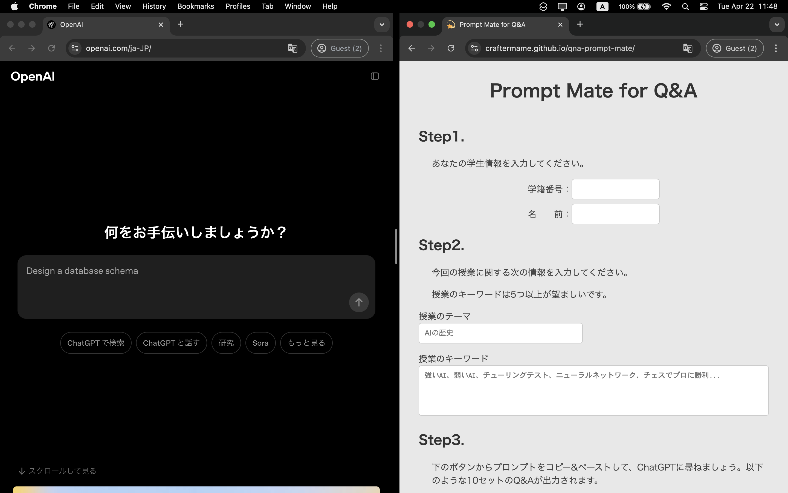

<!-- markdownlint-disable MD033 -->

# Prompt Mate for Q&A

> ⚠️ **Note** 👩‍🎓  
> I made this app to help with the homework of a university class.  
> So, this app may not be useful unless you're taking the class 🏫.

## 💫 Main Features

- Complete your **AI Foundation** class homework in just 5 minutes!!!
- Just COPY and PASTE the prompt to generate the Q&A pairs!
- Working on ChatGPT:
  - Fine-tune ChatGPT’s responses to make them more natural!
  - You can mention specific part of the response by selecting text (a feature of ChatGPT).
- Download a submission-ready file, so you can submit it DIRECTORY!

## Recommended Usage

You can split your window with this app on one side and ChatGPT on the other.

Here is the example.

## Release Note

### Pre-Release v0.1.0 (2025/04/21)

#### 🚀 Features of v0.1.0

- Implemented the foundation of main features.

#### 📌 Notes

- This version focuses on very fundamental functionality.
- If you find any bugs, have feedback, or ideas for helpful features, feel free to share them with me!
